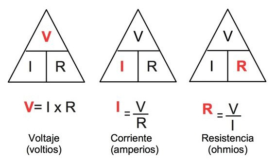

Workshop de electronica

---

## A armar equipos!

---

## ¿Cómo leer circuitos electrónicos?

---

---
## Ley de ohm

---
## Manos a la obra!

---

## Hello led

---
## Arduino + NodeMCU = <3

---
### Instalación

https://observablehq.com/@hdf1986/workshop
---
## Nuestro primer blink!
---
## Utilizando un led externo

---
## Fade

---
## Tipos de señales

---
## Analógicas

---
## Digitales

---
## Sensores!

---
### Botón

---
### Sensor digital (Humedad/Luz)

---
### Sensor analógico (Humedad/Luz)

---
### Sensor digital de temperatura (1wire)

---
### WI-FI y otras yerbas

---
### WifiManager

---
### ON/OFF

---
### Slack

---
### Modo access point

---
### Modo access point captivo

---

## Gracias! ⚡
